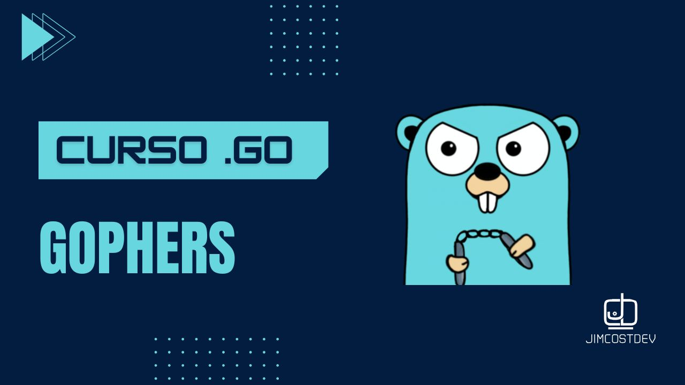

# Programación en Go 🚀

Bienvenido al repositorio oficial del curso de Go. Aquí encontrarás material de apoyo, ejemplos de código y recursos complementarios para aprender Golang.

## 📌 Contenido del curso:

✔️ Fundamentos de Golang  
✔️ Algoritmos y lógica de programación  
✔️ Proyectos prácticos y ejercicios  

🔗 **Lista de reproducción:** [Programación en Go](https://youtube.com/playlist?list=PLlWTGK7QJnmDtruzihqTgdi4FcM2enA1X&si=AvDhsHYjKmEPwZ48)

🚀 **Sumérgete en el mundo de Go y domina uno de los lenguajes más potentes y eficientes de la actualidad.**

---

## ⭐ Apóyanos con una estrella

Si este repositorio te resulta útil, ¡apóyalo con una estrella ⭐!  
Tu apoyo nos motiva a seguir creando más contenido y mejorar los recursos disponibles. ¡Gracias! 😊

---
<!-- banner -->

<!-- frase de EGW -->
 
